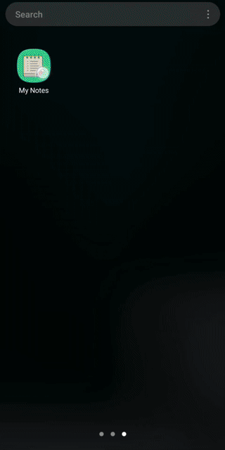

# MyNotes Android App

MyNotes is a robust and intuitive note-taking Android app designed to provide a seamless user experience. Employing the MVVM (Model-View-ViewModel) architecture and leveraging the latest Android components, MyNotes offers a sophisticated yet straightforward platform for managing personal notes.

## Features

- **Create, Edit, and Delete Notes:** Intuitive functions for note management.
- **Persistent Storage:** Leveraging Room for SQLite database integration, ensuring data persistence and reliability.
- **Modern UI:** A clean and responsive user interface adhering to Material Design principles.
- **Swipe to Delete:** Enhanced user experience with gesture-based interaction.

## Technical Overview

The app is built using the MVVM architectural pattern to ensure a clean separation of concerns and enhance the testability and maintainability of the code. Here's a quick rundown of the technical stack:

- **MVVM Architecture:** Separates the user interface logic from business logic with the help of ViewModels.
- **Room Database:** Provides an abstraction layer over SQLite to allow for more robust database access while harnessing the full power of SQLite.
- **LiveData:** Works with the Room database to notify the view of any database changes for seamless UI updates.
- **Data Binding:** Minimizes boilerplate and enhances readability by allowing direct interaction between UI components and data models.
- **Repository Pattern:** Mediates between the data sources (such as the Room database) and the rest of the app, providing a clean API for data access.
- **Kotlin Coroutines:** Manages background threads with simplified code and improved performance.

## Demo

Here's a quick look at how MyNotes works in action:



## Getting Started

Follow these instructions to get the project up and running on your development machine for testing and development purposes.

### Prerequisites

- Android Studio Bumblebee | 2021.1.1 or higher
- JDK 11 or higher

### Installation

To clone the repository and open the project in Android Studio, use the following commands:

```bash
git clone https://github.com/Krishna-Vamsi-G/mynotes.git
